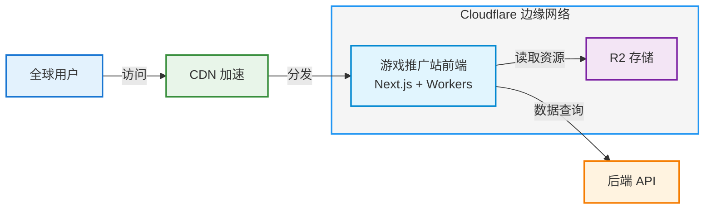

# 前端项目部署教程

> 项目：游戏盒子推广站前端  
> 部署方式：Cloudflare Pages/Workers  
> 更新日期：2025-12-16

---

## 1. 部署架构说明

本前端项目是一个基于 Next.js 的边缘站点，部署在 Cloudflare 边缘网络上：

- **前端站点**：Next.js 14 静态生成 + 边缘渲染
- **部署平台**：Cloudflare Pages 或 Cloudflare Workers
- **CDN 加速**：全球边缘节点分发
- **内容存储**：Markdown 文件存储在项目中，图片可使用 Cloudflare R2



---

## 2. Cloudflare Pages 部署（推荐）

### 2.1 前置准备

- ✅ GitHub/GitLab 仓库（推荐）
- ✅ Cloudflare 账号
- ✅ 自定义域名（可选）

### 2.2 部署步骤

#### 步骤 1：连接 Git 仓库

1. 登录 [Cloudflare Dashboard](https://dash.cloudflare.com/)
2. 进入 **Workers & Pages** > **Pages**
3. 点击 **Create a project**
4. 选择 **Connect to Git**
5. 授权并选择你的仓库

#### 步骤 2：配置构建设置

在构建配置页面填写：

| 配置项 | 值 |
|--------|-----|
| **Framework preset** | Next.js |
| **Build command** | `pnpm build` 或 `npm run build` |
| **Build output directory** | `.next` |
| **Root directory** | `/` |
| **Node version** | 18 或 20 |

#### 步骤 3：环境变量配置（如需要）

如果需要连接后端 API，添加环境变量：

```bash
# 生产环境
NEXT_PUBLIC_API_URL=https://api.yourdomain.com
NODE_VERSION=18
```

#### 步骤 4：部署

1. 点击 **Save and Deploy**
2. 等待构建完成（通常 3-5 分钟）
3. 访问 Cloudflare 提供的预览链接

#### 步骤 5：绑定自定义域名（可选）

1. 在项目设置中选择 **Custom domains**
2. 点击 **Set up a custom domain**
3. 输入你的域名（如 `www.yourdomain.com`）
4. 按照提示配置 DNS 记录

---

## 3. Cloudflare Workers 部署（使用 OpenNext）

### 3.1 安装 OpenNext Adapter

```bash
pnpm add -D @opennextjs/cloudflare
```

### 3.2 配置 `open-next.config.ts`

项目已包含配置文件 `open-next.config.ts`：

```typescript
import type { OpenNextConfig } from '@opennextjs/cloudflare'

const config: OpenNextConfig = {
  default: {
    override: {
      wrapper: 'cloudflare-node',
      converter: 'edge',
      // 其他配置...
    }
  }
}

export default config
```

### 3.3 本地构建

```bash
# 安装依赖
pnpm install

# 构建项目
pnpm build

# 本地预览（可选）
pnpm preview
```

### 3.4 部署到 Cloudflare Workers

```bash
# 使用 wrangler 部署
pnpm wrangler deploy

# 或使用 npm script
pnpm run deploy
```

### 3.5 配置 `wrangler.toml`

项目中的 `wrangler.toml` 配置示例：

```toml
name = "game-box-web"
compatibility_date = "2024-01-01"
compatibility_flags = ["nodejs_compat"]

[site]
bucket = ".open-next/worker"

# 自定义域名
[[routes]]
pattern = "yourdomain.com/*"
custom_domain = true
```

---

## 4. 本地开发

### 4.1 启动开发服务器

```bash
# 安装依赖
pnpm install

# 启动开发服务器
pnpm dev
```

访问 http://localhost:3000

### 4.2 本地构建测试

```bash
# 构建生产版本
pnpm build

# 启动生产服务器
pnpm start
```

---

## 5. 环境变量配置

### 5.1 开发环境

创建 `.env.local` 文件：

```bash
# API 地址（如需对接后端）
NEXT_PUBLIC_API_URL=http://localhost:8080

# 其他配置
NEXT_PUBLIC_SITE_URL=http://localhost:3000
```

### 5.2 生产环境

在 Cloudflare Pages/Workers 中配置：

```bash
NEXT_PUBLIC_API_URL=https://api.yourdomain.com
NEXT_PUBLIC_SITE_URL=https://www.yourdomain.com
```

---

## 6. 性能优化建议

### 6.1 静态资源优化

- ✅ 使用 Next.js Image 组件优化图片
- ✅ 启用 Cloudflare 图片优化
- ✅ 配置合理的缓存策略

### 6.2 SSG/ISR 优化

```typescript
// app/article/[slug]/page.tsx
export const revalidate = 3600 // 1小时重新验证

export async function generateStaticParams() {
  // 预生成文章路径
  const articles = await getArticles()
  return articles.map((article) => ({
    slug: article.slug,
  }))
}
```

### 6.3 边缘缓存配置

在 `next.config.js` 中：

```javascript
module.exports = {
  headers: async () => [
    {
      source: '/article/:path*',
      headers: [
        {
          key: 'Cache-Control',
          value: 'public, max-age=3600, s-maxage=86400',
        },
      ],
    },
  ],
}
```

---

## 7. 常见问题

### 7.1 构建失败

**问题**：构建时提示找不到模块

**解决**：
```bash
# 清理依赖重新安装
rm -rf node_modules pnpm-lock.yaml
pnpm install
```

### 7.2 图片加载慢

**问题**：图片加载速度慢

**解决**：
- 启用 Cloudflare Image Optimization
- 使用 Next.js Image 组件
- 配置图片懒加载

### 7.3 API 调用失败

**问题**：前端无法访问后端 API

**解决**：
- 检查 CORS 配置
- 确认环境变量设置正确
- 检查 API 地址是否可访问

### 7.4 路由 404 错误

**问题**：刷新页面出现 404

**解决**：
- 确保 Cloudflare Pages 配置了正确的路由规则
- 检查 `next.config.js` 中的 `trailingSlash` 配置

---

## 8. 监控与维护

### 8.1 查看部署日志

在 Cloudflare Dashboard 中：
1. 进入项目页面
2. 点击 **Deployments** 查看部署历史
3. 点击具体部署查看构建日志

### 8.2 性能监控

- 使用 Cloudflare Analytics 查看流量和性能
- 配置 Web Analytics 追踪用户行为
- 启用 Real User Monitoring (RUM)

### 8.3 自动部署

每次推送到主分支会自动触发部署：

```bash
git add .
git commit -m "update content"
git push origin main
```

---

## 9. 回滚操作

如果新版本出现问题，可以快速回滚：

1. 进入 Cloudflare Pages 项目
2. 点击 **Deployments**
3. 找到之前的稳定版本
4. 点击 **Rollback to this deployment**

---

## 10. 参考链接

- [Next.js 部署文档](https://nextjs.org/docs/deployment)
- [Cloudflare Pages 文档](https://developers.cloudflare.com/pages/)
- [OpenNext Cloudflare Adapter](https://opennext.js.org/cloudflare)
- [Wrangler CLI 文档](https://developers.cloudflare.com/workers/wrangler/)
